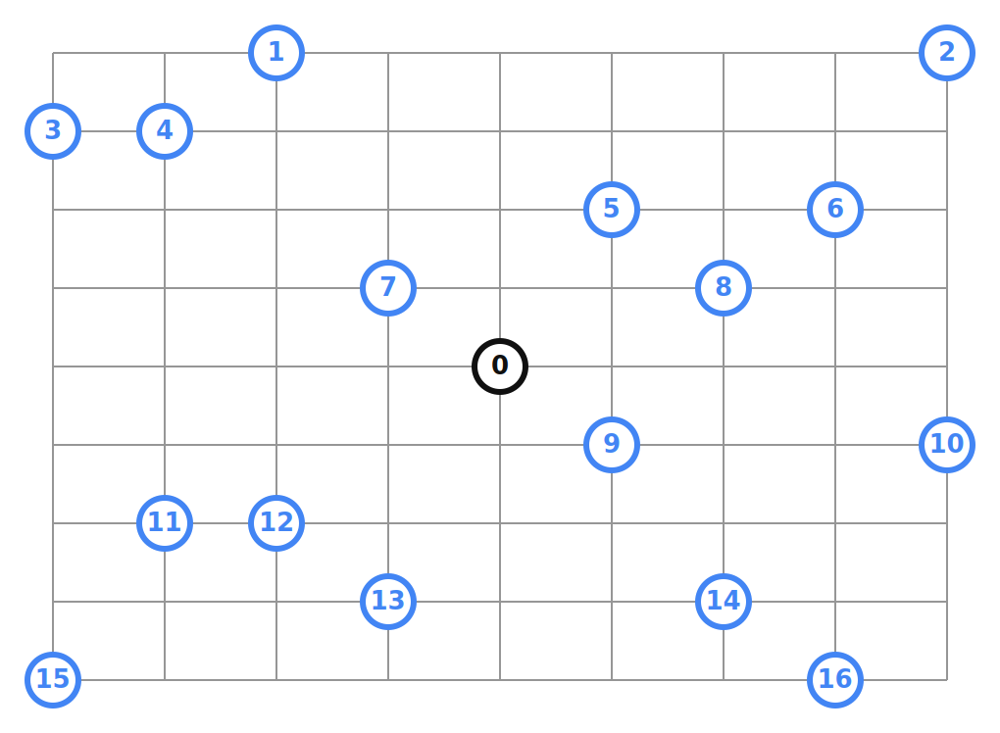
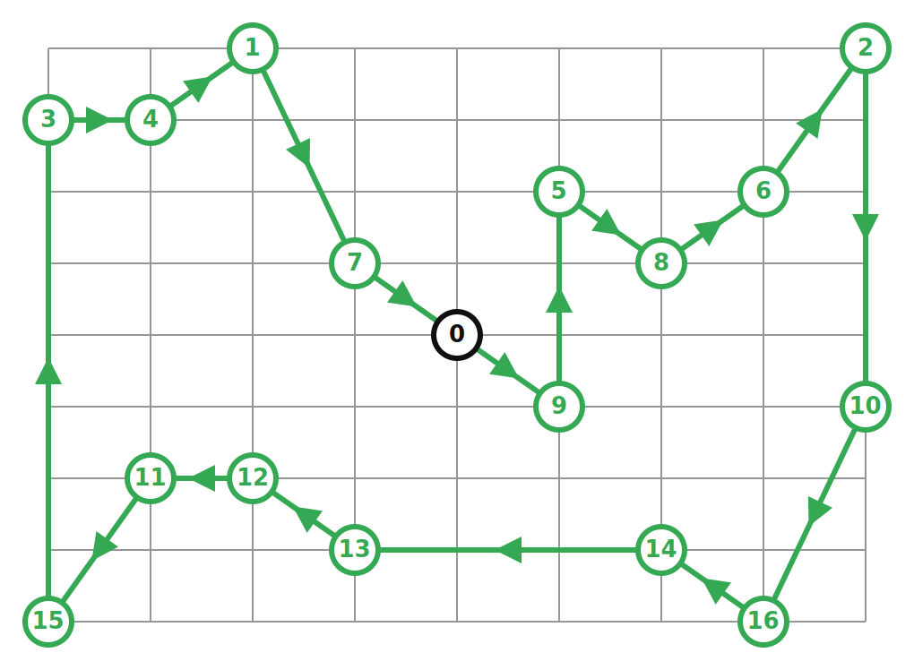
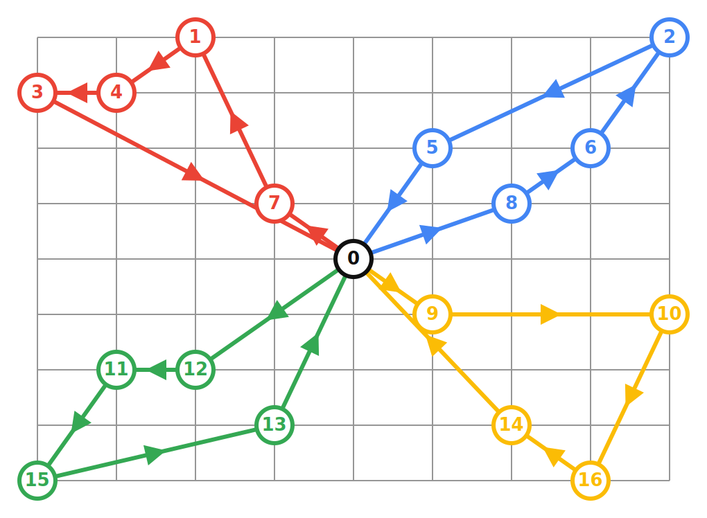
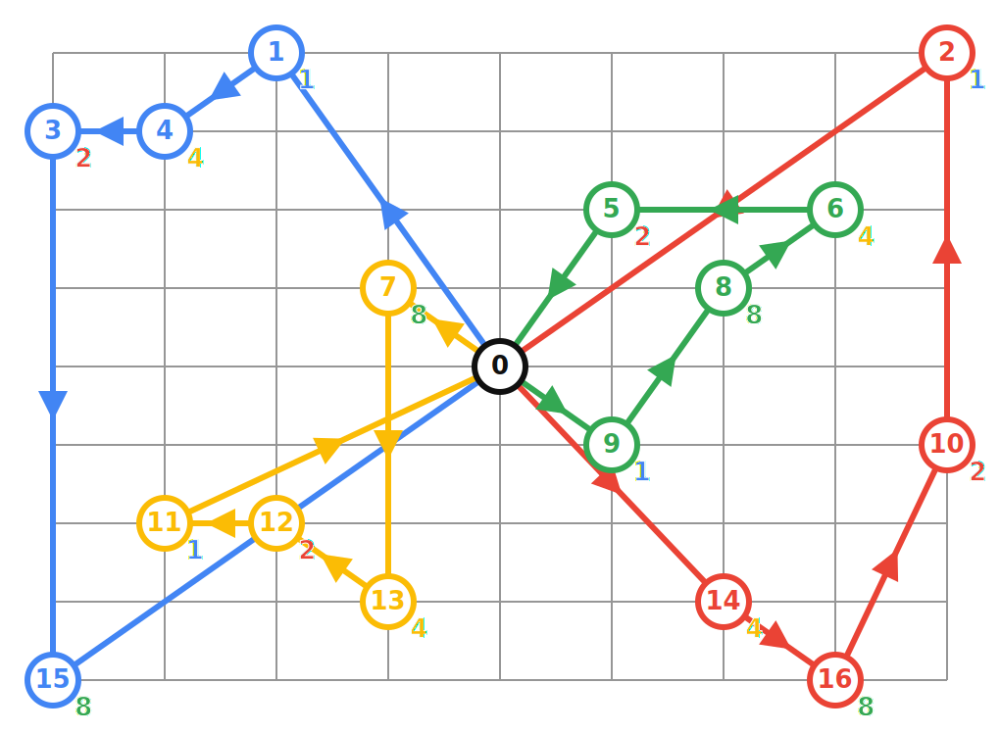
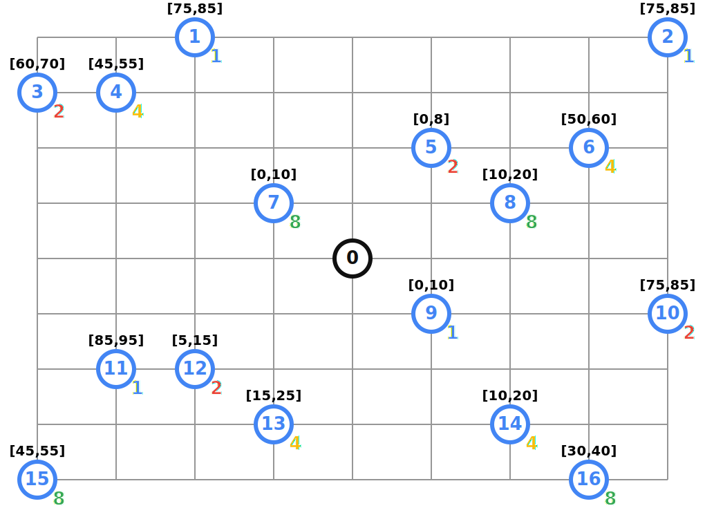

# Routing Samples

OR-Tools comes with lots of routing samples

## Table of Contents

* [VRP](#vehicle-routing-problem)
* [CVRP](#capacitated-vehicle-routing-problem)
* [CVRPTW](#capacitated-vehicle-routing-problem-with-time-window)
* [Misc](#misc)

## Vehicle Routing Problem
Data Problem:

Solution:

src: [vrp.py](vrp.py)

### GlobalSpan on Distance Dimension
Solution:

src: [vrpgs.py](vrpgs.py)

## Capacitated Vehicle Routing Problem
Data Problem:

Solution:

src: [cvrp.py](cvrp.py)

## Capacitated Vehicle Routing Problem with Time Windows
Data Problem:

Solution:

src: [cvrptw.py](cvrptw.py)

## Misc
Images have been generated using [`vrp_svg.py`](vrp_vg.py) through bash script:
```sh
./generate_svg.sh
```
src: [generate_svg.sh](generate_svg.sh)
